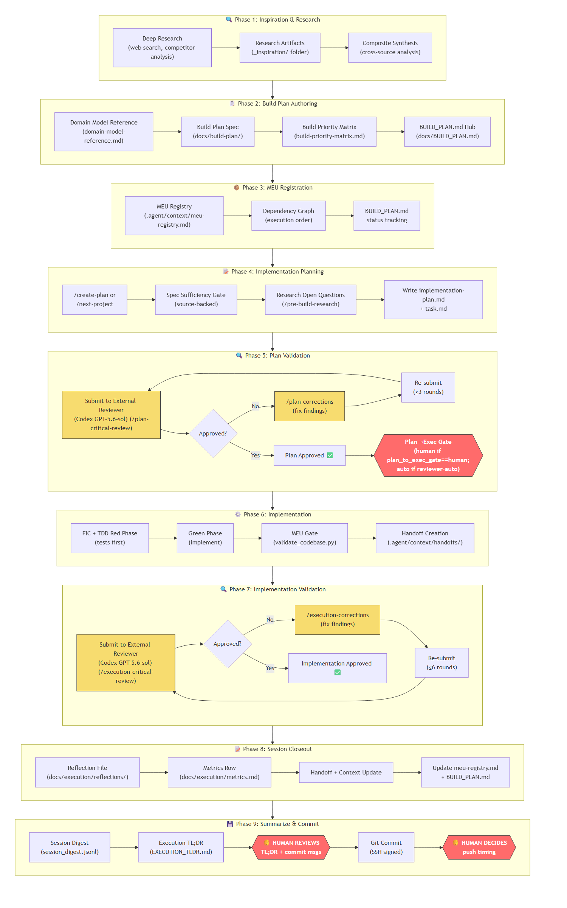

# Agentic Delivery Framework — Portable Edition

> A governance framework for agentic work. It does not do the work — it constrains **how** the
> work gets done, so a capable-but-overconfident model cannot ship something plausible-and-wrong.
>
> Extracted from a real, long-running project. **Every rule in `GUARDRAILS.md` exists because a
> specific failure actually happened.** None of it is theoretical.



The nine-phase delivery loop — research → plan → independent review → implement → validate →
human-gated commit. ([SVG source](core/.agent/docs/diagrams/development-lifecycle-overview.svg) ·
full write-up in [`development-lifecycle.md`](core/.agent/docs/development-lifecycle.md))

---

## Start here (in this order)

| # | File | What it's for |
|---|---|---|
| 1 | **[ADOPTION-QUESTIONS.md](ADOPTION-QUESTIONS.md)** | **Answer these FIRST.** The questions an adopting agent must put to the human before copying a single file. Each one configures a named safety gate. |
| 2 | **[ADOPTION-GUIDE.md](ADOPTION-GUIDE.md)** | Step-by-step instructions for the adopting AI agent: copy, instantiate, translate, validate. |
| 3 | **[DOMAIN-MAPPING.md](DOMAIN-MAPPING.md)** | How the code-flavored vocabulary (MEU, TDD, tests) translates to **legal, clinical, research, finance** and other domains. |
| 4 | **[core/MANIFEST.md](core/MANIFEST.md)** | Every file in the package, its purpose, and what was deliberately excluded as project-specific. |
| 5 | **[UPDATE-CHECKLIST.md](UPDATE-CHECKLIST.md)** | How to refresh this package when the source repo's governance/subagent flows change. |
| 6 | **[examples/](examples/)** | A real multi-round independent review — including the reviewer catching genuine safety bugs the implementing agent missed. |

---

## What's actually in here

```
core/
  AGENTS.md            operating model, priority hierarchy, execution contract
  GUARDRAILS.md        the SIGNs — safety constraints, each from a real incident
  CLAUDE.md            bootstrap file the harness auto-loads
  .agent/
    docs/              harness-profiles, model-routing, triage-meu-loop,
                       macos-setup, context-tool-decision-gate, ...
    workflows/         create-plan, issue-triage, session-grouping,
                       inspiration-research, review loops, ...
    roles/             orchestrator, coder, tester, reviewer, researcher, guardrail
    skills/            issue-triage, meu-status, deep-research-prompting,
                       subagent-delegation, cli-dispatch, ...
    context/           empty seeds: known-issues.yaml, meu-status.yaml, grouping/
    schemas/           reflection.v1.yaml, review-verdict.schema.json
  tools/               issue_triage + meu_status CLIs, Invoke-CodexDispatch.ps1/.sh
  .cursor/agents/      Cursor Task subtypes: {{PROJECT_NAME}}-builder / -verifier
  .claude/agents/      Claude Code Agent/Task defs (same pair; different model pins)
  templates/           plan, task, handoff, review, reflection, BUILD_PLAN-STUB
scripts/
  instantiate.py       fill {{PLACEHOLDER}} tokens with your project's values (adopters run this)
  sanitize.py          the authoring tool that produced the placeholders (audit/re-gen)
  placeholders.py      shared substitution rules · README.md — usage
UPDATE-CHECKLIST.md    when/how to refresh this package from the source repo
```

> **Platform note:** Windows adopters use PowerShell all-stream redirect (`*>`). macOS/Linux
> adopters follow **`core/.agent/docs/macos-setup.md`** for `pwsh`/POSIX redirect syntax, Codex CLI
> install, and cross-platform dispatch — read it before your first shell command.

> **Learning-from-mistakes engine:** the issue → MEU → plan loop (`tools/issue_triage*`,
> `tools/meu_status*`, `.agent/docs/triage-meu-loop.md`, `/issue-triage` → `/session-grouping` →
> `/create-plan`) turns reported defects into registered MEUs and reflection design rules. See
> `ADOPTION-GUIDE.md` Step 4b.

> The `core/` files ship with project-neutral `{{PLACEHOLDER}}` tokens. Your first install
> step is `scripts/instantiate.py` — see `ADOPTION-GUIDE.md` Step 2b (after Step 2a platform
> selection).

---

## The six ideas underneath the jargon

The vocabulary is code-flavored. The discipline is not. Strip the jargon and you get:

1. **Decompose** work into units small enough to verify.
2. **Write the acceptance criteria BEFORE doing the work.** (In research this is literally
   pre-registration; in law it's the elements you must prove. It is an anti-rationalization device.)
3. **Produce evidence, not assertions.** Nothing is "done" without an evidence bundle.
4. **Someone else checks it.** The agent that did the work never authors its own approval.
5. **Stop at a human** before anything irreversible.
6. **Keep durable state in files** — so a summary, a crash, or a context limit never loses it.

Each of these is *more* valuable outside software than inside it, because the cost of a
confident-but-wrong answer is higher when it's a citation, a diagnosis, or a finding.

---

## Two things that make it portable

**Capability flags, not product names.** Nothing branches on "if the harness is Claude Code."
It branches on *capabilities* — can it shell out? does it inject auto-approval messages? who
authorizes execution? A new harness needs one new row, not edits across a dozen files. An
unrecognized harness inherits the **safest** defaults, never the most permissive.

**A routed model stack.** Coordinate on the strongest model, delegate bulk/mechanical work to a
cheaper builder (in-harness `{{PROJECT_NAME}}-builder` / `-verifier` when `fresh_worker`
resolves), route independent review to a *different vendor* (different training distribution ⇒
different blind spots). Optional — the framework works fine on a single model; you lose the cost
optimization, not the safety.

---

## Honest limitations

- **It is heavyweight.** For a one-off script or a quick question, it is overkill. It pays off on
  work that is long-running, high-stakes, or where being confidently wrong is expensive.
- **It was hardened on software.** The core generalizes well (see `DOMAIN-MAPPING.md`), but the
  testing/shell specifics need real translation — not a find-and-replace.
- **The external-reviewer step sends your work to a third-party model.** In legal, health, or
  research that can be a serious breach. `ADOPTION-QUESTIONS.md` Block C exists precisely for
  this, and the framework supports a **human-only review** mode. Read it before you wire anything up.
- **Instruction bloat is itself a failure mode.** The framework carries a *deletion budget* —
  every new rule must delete or merge an old one. Respect it; overlong instruction files
  measurably reduce agent success.

---

## The five things to keep if you keep nothing else

1. Human gates on irreversible actions + **system-message immunity** (an injected "approved" is
   not human approval).
2. **Independent review. Never self-review.**
3. **Criteria before work** — and never revise the criteria to match the result you got.
4. **Evidence-first completion** — no placeholders, no unverified "done".
5. **Source labels on every claim.** *"Best practice"* alone is never a source.

Everything else is optimization. Those five are the safety.
