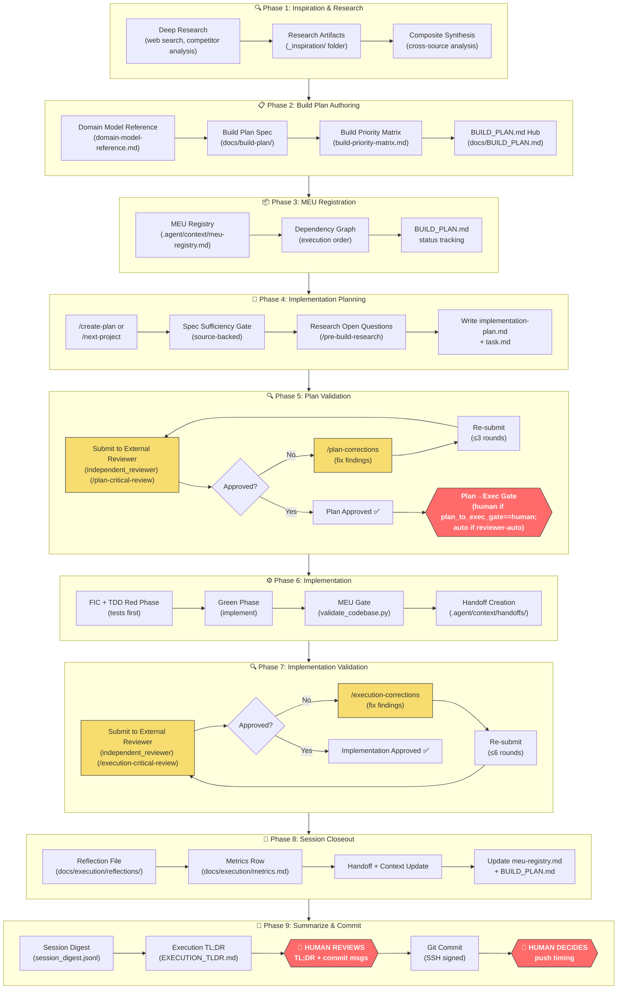
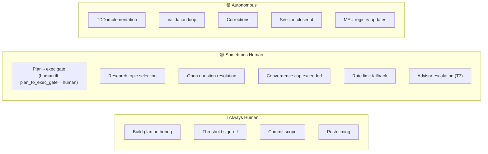
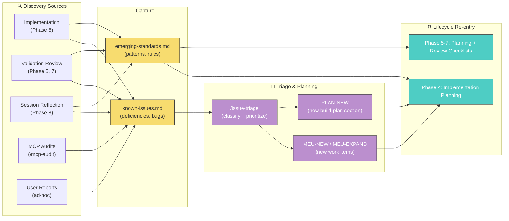

# {{PROJECT_NAME_TITLE}} Agentic Development Lifecycle

> **Canonical reference (source of truth)** for the end-to-end process from inspiration to committed code.
> Describes every phase, the human intervention points, and which files/workflows are involved.
>
> **Audience:** Any developer (human or AI agent) working on {{PROJECT_NAME_TITLE}} or adapting this process.
>
> **Companion doc:** [`agentic-methodology.md`](agentic-methodology.md) is the narrative *why* (philosophy, economics, design rationale). This document is the operational *how* — when the two ever disagree on mechanics, **this document wins**.
>
> **Last updated:** 2026-06-18

---

## Process Overview Diagram



---

## Phase 1: Inspiration & Deep Research

**Purpose:** Gather domain knowledge, competitor patterns, technical research, and design inspiration before any code or plan is written.

**Human involvement:** 🟡 Human initiates research topics; agent executes autonomously.

### Process

1. **Human identifies research need** — e.g., "research how to automate validation loops"
2. **Agent conducts deep research** using:
   - `/pre-build-research` workflow → [pre-build-research.md](https://{{REPO_URL}}/blob/main/.agent/workflows/pre-build-research.md)
   - `search_web` for external sources
   - `read_url_content` for documentation deep-dives
3. **Research artifacts saved** to `_inspiration/` folder, organized by topic:
   - Individual model responses (ChatGPT, Claude, Gemini)
   - Composite synthesis (cross-source analysis)
   - Deep research prompts used

### Key Files

| File | Purpose |
|------|---------|
| [`_inspiration/`](https://{{REPO_URL}}/blob/main/_inspiration) | Research artifacts root |
| [`_inspiration/{topic}-research/`](https://{{REPO_URL}}/blob/main/_inspiration) | Per-topic research folders |
| [`composite-synthesis.md`](https://{{REPO_URL}}/blob/main/_inspiration/_validation_automation-research/composite-synthesis.md) | Cross-source synthesis example |

### 🔄 Adaptability Notes

> To adapt for another project: create a `_inspiration/` folder at project root. The `/pre-build-research` workflow is project-agnostic — it searches, synthesizes, and saves. Only the search queries are project-specific.

---

## Phase 2: Build Plan Authoring

**Purpose:** Translate research and product requirements into structured, phase-ordered build specifications that agents can implement.

**Human involvement:** 🔴 Heavy — human authors or deeply reviews all build plan documents. These are the product specification.

### Process

1. **Human writes or reviews build plan specs** in `docs/build-plan/` (one file per phase/feature area)
2. **Agent may assist** with formatting, research, and consistency checks
3. **Priority matrix** orders all work across phases
4. **BUILD_PLAN.md** serves as the hub/index linking all plan files

### Key Files

| File | Purpose |
|------|---------|
| [`docs/build-plan/`](https://{{REPO_URL}}/blob/main/docs/build-plan) | 68 phase-specific plan files |
| [`docs/build-plan/build-priority-matrix.md`](https://{{REPO_URL}}/blob/main/docs/build-plan/build-priority-matrix.md) | Global priority ordering |
| [`docs/build-plan/domain-model-reference.md`](https://{{REPO_URL}}/blob/main/docs/build-plan/domain-model-reference.md) | Entity/value object reference |
| [`docs/BUILD_PLAN.md`](https://{{REPO_URL}}/blob/main/docs/BUILD_PLAN.md) | Hub index linking all plans |

### Build Plan File Naming Convention

```
docs/build-plan/
├── 00-overview.md              # Project overview
├── 01-domain-layer.md          # Phase 1 spec
├── 01a-logging.md              # Phase 1A sub-spec
├── 02-infrastructure.md        # Phase 2 spec
│   ...
├── build-priority-matrix.md    # Cross-phase priority ordering
└── domain-model-reference.md   # Entity definitions
```

### 🔄 Adaptability Notes

> Build plan structure is fully project-specific. For a non-application project (like workflow automation), you can create plan files in a different location (e.g., `docs/execution/plans/`) and skip the standard phase numbering. The key requirement is: **one canonical spec document per feature area with enough detail for an agent to implement without guessing.**

---

## Phase 3: MEU Registration

**Purpose:** Break build plan specs into Manageable Execution Units (MEUs) — the atomic unit of work that goes through the full TDD lifecycle.

**Human involvement:** 🟡 Agent proposes MEU breakdown; human reviews via plan approval.

### Process

1. **Agent reads build plan** and proposes MEU decomposition via `/next-project` or `/create-plan`
2. **MEUs registered** in the MEU registry with slug, matrix reference, description, and status
3. **Dependency graph** established (which MEUs must complete before others can start)
4. **BUILD_PLAN.md** updated with MEU references and status tracking

### Key Files

| File | Purpose |
|------|---------|
| [`.agent/context/meu-registry.md`](https://{{REPO_URL}}/blob/main/.agent/context/meu-registry.md) | Master MEU registry (all phases) |
| [`docs/BUILD_PLAN.md`](https://{{REPO_URL}}/blob/main/docs/BUILD_PLAN.md) | Status tracking per MEU |
| [`docs/build-plan/build-priority-matrix.md`](https://{{REPO_URL}}/blob/main/docs/build-plan/build-priority-matrix.md) | MEU ordering |

### MEU Status Legend

| Symbol | Meaning |
|--------|---------|
| ⬜ | Pending (not started) |
| 🟡 | In progress |
| ✅ | Approved / Complete |
| 🚫 | Closed (won't fix) |
| [B] | Blocked (dependency) |

### 🔄 Adaptability Notes

> For non-standard work (like process improvement), MEUs can represent logical work units rather than code modules. The key properties are: **one clear deliverable, one validation command, fits in a single TDD cycle.** The MEU registry format is project-specific but the concept is universal.

---

## Phase 4: Implementation Planning

**Purpose:** Create a detailed, source-backed implementation plan and task checklist for a group of related MEUs (a "project").

**Human involvement:** 🔴 **Gated** — plan review is auto-dispatched (Phase 5), not human-triggered. The plan→execution transition then branches on `plan_to_exec_gate` (`.agent/docs/harness-profiles.md`): `human` (Claude Code / Cursor / headless / UNKNOWN) pauses for the user's explicit go-ahead after `approved`; `reviewer-auto` (legacy Antigravity driver, currently dormant) auto-continues. See `GUARDRAILS.md` SIGN 1 and `create-plan.md` §5c.

### Process

1. **Agent invokes** `/create-plan` or `/next-project` → [create-plan.md](https://{{REPO_URL}}/blob/main/.agent/workflows/create-plan.md)
2. **Spec Sufficiency Gate** — every behavior must be tagged with a source:
   - `Spec` — explicit in build plan
   - `Local Canon` — in another canonical doc
   - `Research-backed` — from web research
   - `Human-approved` — explicit user decision
3. **Open questions researched** via web search + sequential thinking (Step 2B)
4. **Plan + task files written** to `docs/execution/plans/{YYYY-MM-DD}-{project-slug}/`
5. **Auto-dispatch to review** — the plan is automatically submitted to the external reviewer (Phase 5, `create-plan.md` §5); this is not a human stop. The `plan_to_exec_gate` branch (human go-ahead vs. reviewer-auto continue) applies only after the reviewer returns `approved` — see Phase 5.

### Key Files

| File | Purpose |
|------|---------|
| [`docs/execution/plans/PLAN-TEMPLATE.md`](https://{{REPO_URL}}/blob/main/docs/execution/plans/PLAN-TEMPLATE.md) | Plan template (v2.0) |
| [`docs/execution/plans/TASK-TEMPLATE.md`](https://{{REPO_URL}}/blob/main/docs/execution/plans/TASK-TEMPLATE.md) | Task template (v2.1) |
| `docs/execution/plans/{date}-{slug}/implementation-plan.md` | Per-project plan |
| `docs/execution/plans/{date}-{slug}/task.md` | Per-project task checklist |

### Human Decision Points

| Decision | When | Why |
|----------|------|-----|
| **Plan approval** | Branches on `plan_to_exec_gate` after reviewer `approved` (Step 5c) | `human` gate: ensures agent's understanding matches human intent; `reviewer-auto`: auto-continues |
| **Open question resolution** | During plan review | When multiple valid approaches exist |
| **Threshold sign-off** | When plan proposes novel numeric values | Governance values need human confirmation |

### 🔄 Adaptability Notes

> The plan/task template structure works for any project. For non-application work (workflows, docs, process), set the "Non-Standard Project Notice" flag and note that TDD conventions apply in spirit. The Spec Sufficiency Gate is the most valuable transferable element — it prevents agents from inventing behavior.

---

## Phase 5: Plan Validation (External Reviewer Loop)

**Purpose:** Independent AI review of the plan for accuracy, consistency, and completeness before any code is written. The reviewer role is role-generic, not vendor-fixed — the independent-reviewer chain (Codex GPT-5.6-sol primary → Gemini 3.5 surface-only → headless `claude -p` last resort) is defined in `.agent/docs/model-routing.md`; "Codex" below names the current primary reviewer.

**Human involvement:** 🟡 Review is auto-dispatched by the workflow (`create-plan.md` §5), not human-triggered. Doc-only corrections applied via [plan-corrections.md](https://{{REPO_URL}}/blob/main/.agent/workflows/plan-corrections.md) auto-proceed (reversible, no separate approval gate); the re-dispatched review is what re-validates the fix. Human intervenes only for the round-cap/rate-limit HARD STOPs, a reviewer human-decision-required question, or — once `approved` — the `plan_to_exec_gate == human` go-ahead (`.agent/docs/harness-profiles.md`, `GUARDRAILS.md` SIGN 1).

### Process

1. **Agent dispatches** plan to the external reviewer (Codex GPT-5.6-sol primary; see `.agent/docs/model-routing.md`) via [cli-dispatch/SKILL.md](https://{{REPO_URL}}/blob/main/.agent/skills/cli-dispatch/SKILL.md)
2. **Codex reviews** against checklist (PR-1 through PR-6, DR-1 through DR-8)
3. **If findings:** agent applies `/plan-corrections` → [plan-corrections.md](https://{{REPO_URL}}/blob/main/.agent/workflows/plan-corrections.md)
4. **Re-submit** for review
5. **Loop until approved** (max 3 rounds before T2 escalation)

### Governance Rules (Resolved 2026-06-04)

> [!NOTE]
> These values are the **approved target state** from [implementation-plan.md](https://{{REPO_URL}}/blob/main/docs/execution/plans/2026-06-04-agentic-workflow-automation/implementation-plan.md). Some live workflow files (e.g., `validation-review.md`, `meu-handoff.md`, `REVIEW-TEMPLATE.md`) still contain old values ("2 revision cycles", `High|Medium|Low`). These will be updated when the agentic workflow automation project is executed.

| Rule | Value | Source |
|------|-------|--------|
| Plan convergence cap | 3 non-approved rounds → T2 escalation | Human-approved + external-reviewer (Codex GPT-5.6-sol) advisory |
| First review depth | Always `xhigh` reasoning effort | Human-approved + external-reviewer (Codex GPT-5.6-sol) advisory |
| Follow-up depth | <200 LOC `medium`, 200-400 `high`, >400 `xhigh` | Human-approved + external-reviewer (Codex GPT-5.6-sol) advisory |
| Governance files | Always `xhigh` regardless of LOC | Human-approved + external-reviewer (Codex GPT-5.6-sol) advisory |
| `low` effort | Never used — minimum is `medium` | Human-approved |

### Rate Limit Fallback

When a reviewer CLI hits a rate limit, the [Rate-Limit Fallback Protocol](https://{{REPO_URL}}/blob/main/.agent/skills/cli-dispatch/SKILL.md) walks the independent-reviewer chain **in order first**, and only escalates to human/web submission when **all rungs** are exhausted:
1. Try the next reviewer rung (Codex GPT-5.6-sol → Gemini surface → headless Claude last-resort; canonical in `.agent/docs/model-routing.md`)
2. If **all rungs** are rate-limited/unavailable: save prompt to `{{RECEIPTS_DIR}}/dispatch/<provider>-web-prompt.md`, adapt for web submission (inline context, markdown)
3. Human submits to web interface manually (a HARD STOP at a human gate — never self-review)
4. Paste response back; agent continues

### Key Files

| File | Purpose |
|------|---------|
| [`.agent/workflows/plan-critical-review.md`](https://{{REPO_URL}}/blob/main/.agent/workflows/plan-critical-review.md) | Review workflow |
| [`.agent/workflows/plan-corrections.md`](https://{{REPO_URL}}/blob/main/.agent/workflows/plan-corrections.md) | Corrections workflow |
| [`.agent/skills/cli-dispatch/SKILL.md`](https://{{REPO_URL}}/blob/main/.agent/skills/cli-dispatch/SKILL.md) | CLI dispatch (Codex, Claude, agy) |
| `.agent/context/handoffs/*-plan-critical-review.md` | Rolling review handoff |

### 🔄 Adaptability Notes

> The validation loop is fully project-agnostic. Convergence caps, depth bands, and the correction workflow work for any codebase. The only project-specific element is the checklist items (PR-1 through PR-6 etc.) which can be customized per project.

---

## Phase 6: Implementation (TDD Execution)

**Purpose:** Implement the approved plan using strict TDD discipline: tests first, then code, then validation.

**Human involvement:** 🟢 Autonomous — agent executes continuously until all MEUs complete. Human intervenes only on blocked/unresolvable issues.

### Process

1. **Agent enters EXECUTION mode** via `/execution-session` or `/tdd-implementation`
2. **Per MEU:**
   a. Write **Feature Intent Contract (FIC)** with acceptance criteria
   b. Write **all tests first** (Red phase) — confirm they fail
   c. **Implement** just enough code to pass (Green phase)
   d. **Refactor** while keeping tests green
   e. Run **MEU gate**: `uv run python tools/validate_codebase.py --scope meu`
   f. Create **handoff** at `.agent/context/handoffs/`
3. **Post-MEU deliverables** (all in same continuous pass):
   - Update MEU registry
   - Update BUILD_PLAN.md
   - Run full regression
   - OpenAPI drift check (if API modified)

### Key Files & Workflows

| File | Purpose |
|------|---------|
| [`.agent/workflows/tdd-implementation.md`](https://{{REPO_URL}}/blob/main/.agent/workflows/tdd-implementation.md) | TDD workflow |
| [`.agent/workflows/execution-session.md`](https://{{REPO_URL}}/blob/main/.agent/workflows/execution-session.md) | Session structure |
| [`.agent/workflows/meu-handoff.md`](https://{{REPO_URL}}/blob/main/.agent/workflows/meu-handoff.md) | Handoff protocol |
| [`.agent/skills/quality-gate/SKILL.md`](https://{{REPO_URL}}/blob/main/.agent/skills/quality-gate/SKILL.md) | Validation pipeline |
| [`.agent/skills/pre-handoff-review/SKILL.md`](https://{{REPO_URL}}/blob/main/.agent/skills/pre-handoff-review/SKILL.md) | Self-review before submission |

### Diff Gate (Resolved 2026-06-04)

| Rule | Value |
|------|-------|
| Target submission size | ≤200 effective LOC |
| Hard split gate | >400 effective LOC |
| >400 override | Requires `xhigh` review |
| >600 override | Requires Advisor approval |
| >1000 override | Requires Human approval |

### 🔄 Adaptability Notes

> TDD is specific to code-producing projects. For documentation/workflow projects, replace with "write spec → implement → verify against spec." The MEU gate (`validate_codebase.py`) is {{PROJECT_NAME_TITLE}}-specific; other projects need their own validation script. The handoff protocol is fully transferable.

---

## Phase 7: Implementation Validation (External Reviewer Loop)

**Purpose:** Independent AI review of the completed implementation for correctness, test rigor, and contract compliance. As in Phase 5, the reviewer role is role-generic — see `.agent/docs/model-routing.md` for the independent-reviewer chain; "Codex" below names the current primary reviewer.

**Human involvement:** 🟡 Review is auto-dispatched by the workflow (`/execution-critical-review`), not human-triggered. Code/test corrections applied via [execution-corrections.md](https://{{REPO_URL}}/blob/main/.agent/workflows/execution-corrections.md) auto-proceed (reversible work under `AGENTS.md` §Hard Gates, no separate approval gate); the re-dispatched execution-critical-review is what re-validates the fix. Human intervenes only for the round-cap/rate-limit HARD STOPs or a reviewer human-decision-required question.

### Process

1. **Agent dispatches** handoff to the external reviewer (Codex GPT-5.6-sol primary; see `.agent/docs/model-routing.md`) via `/execution-critical-review`
2. **Codex reviews** implementation against FIC acceptance criteria
3. **If findings:** agent applies `/execution-corrections`
4. **Re-submit** for review
5. **Loop until approved** (max 6 rounds before T2 escalation)

### Convergence Governance

| Rule | Value |
|------|-------|
| Implementation convergence cap | 6 non-approved rounds → T2 escalation |
| Approval on final round | Valid |
| 7th autonomous round | Requires Advisor approval |
| Early escalation | Same high-severity finding survives 2 fix attempts |

### Key Files

| File | Purpose |
|------|---------|
| [`.agent/workflows/execution-critical-review.md`](https://{{REPO_URL}}/blob/main/.agent/workflows/execution-critical-review.md) | Review workflow |
| [`.agent/workflows/execution-corrections.md`](https://{{REPO_URL}}/blob/main/.agent/workflows/execution-corrections.md) | Corrections workflow |
| `.agent/context/handoffs/*-implementation-critical-review.md` | Rolling review handoff |

### 🔄 Adaptability Notes

> Same as Phase 5 — the review/corrections loop is project-agnostic. Only the review checklist items need customization.

---

## Phase 8: Session Closeout & Documentation

**Purpose:** Create institutional memory — reflections, metrics, handoffs, and session state that enable future agents to continue the work.

**Human involvement:** 🟢 Autonomous — agent completes all closeout artifacts before ending turn.

> [!NOTE]
> **Ordering variance:** [execution-session.md](https://{{REPO_URL}}/blob/main/.agent/workflows/execution-session.md) places reflection creation after Codex validation (Phase 7), while [tdd-implementation.md](https://{{REPO_URL}}/blob/main/.agent/workflows/tdd-implementation.md) places it during Step 6.7 before handoff completion. The canonical ordering is: **implementation → validation → closeout** (execution-session.md takes precedence as the session-level workflow).

### Process

1. **Load templates and exemplars** (mandatory — never write from memory)
2. **Create reflection** at `docs/execution/reflections/{date}-{slug}-reflection.md`
3. **Update metrics** in `docs/execution/metrics.md`
4. **Create/update handoff** at `.agent/context/handoffs/{date}-{slug}-handoff.md`
6. **Update context files:**
   - `.agent/context/current-focus.md` — what's next
   - `.agent/context/known-issues.md` — resolved issues archived
   - `.agent/context/meu-registry.md` — status updates

### Key Files

| File | Purpose |
|------|---------|
| [`docs/execution/reflections/TEMPLATE.md`](https://{{REPO_URL}}/blob/main/docs/execution/reflections/TEMPLATE.md) | Reflection template |
| [`.agent/context/handoffs/TEMPLATE.md`](https://{{REPO_URL}}/blob/main/.agent/context/handoffs/TEMPLATE.md) | Handoff template |
| [`docs/execution/metrics.md`](https://{{REPO_URL}}/blob/main/docs/execution/metrics.md) | Session metrics table |
| [`.agent/context/current-focus.md`](https://{{REPO_URL}}/blob/main/.agent/context/current-focus.md) | Current project state |
| [`.agent/context/known-issues.md`](https://{{REPO_URL}}/blob/main/.agent/context/known-issues.md) | Known issues tracker |

### Closeout Quality Gate

Before declaring complete, the agent must verify:
- Reflection has all required markers (9 sections)
- Token counts are populated (never zero)
- Handoff has all required markers (4 sections)
- Metrics row appended
- No `REPLACE_ME` placeholders

### 🔄 Adaptability Notes

> Reflection and handoff templates are project-specific but the concept is universal. Any multi-session agentic project benefits from structured closeout. The metrics table schema can be adapted.

---

## Phase 9: Summarize & Commit

**Purpose:** Summarize the session and commit completed work to version control. Human retains full control over commit scope and push timing.

**Human involvement:** 🔴 **Human decides everything** — commit scope, message, push timing.

### Process

1. **Agent runs session digest** → `.agent/skills/session-digest/` assembles decisions, blockers, and progress from handoffs + decision log + validation rounds into `session_digest.jsonl`
2. **Agent runs execution TL;DR** → `.agent/skills/execution-tldr/` generates a 2-minute human summary at `.agent/context/EXECUTION_TLDR.md` (Codex CLI, `reasoning_effort=medium`)
3. **Agent proposes** commit messages (grouped by logical change), includes TL;DR summary in the commit body, and omits AI attribution trailers or generated-by statements such as `Co-Authored-By: Claude`
4. **🧑 Human reviews** TL;DR and commit messages
5. **🧑 Human decides** commit scope (split, squash, or as-proposed)
6. **Agent executes** `git commit` per [git-workflow/SKILL.md](https://{{REPO_URL}}/blob/main/.agent/skills/git-workflow/SKILL.md)
7. **🧑 Human decides** when to push (never auto-pushed)

> [!NOTE]
> Steps 1-2 use **planned infrastructure** from the [agentic workflow automation project](https://{{REPO_URL}}/blob/main/docs/execution/plans/2026-06-04-agentic-workflow-automation/implementation-plan.md): `execution-tldr` is Phase 3 (task rows 21-25) and `session-digest` is Phase 5 (task rows 34-38). Until those skills exist, session summarization is done manually via Phase 8 closeout artifacts (reflection, handoff).
>

### Rules

| Rule | Source |
|------|--------|
| Never auto-commit | AGENTS.md §Execution Contract |
| Never auto-push | Human decision only |
| SSH commit signing | git-workflow/SKILL.md |
| Proposed messages only | Agent suggests, human approves |

### 🔄 Adaptability Notes

> Git workflow is fully project-agnostic. The SSH signing configuration is environment-specific.

---

## Human Intervention Summary



| Phase | Human Role | Intervention Type |
|-------|-----------|-------------------|
| 1. Research | Initiator | Chooses research topics |
| 2. Build Plan | Author/Reviewer | Writes or deeply reviews specs |
| 3. MEU Registration | Reviewer | Reviews via plan approval |
| 4. Implementation Planning | **Gate (`plan_to_exec_gate`)** | `human`: pauses for explicit go-ahead after reviewer `approved`; `reviewer-auto`: auto-continues |
| 5. Plan Validation | Gate + Approver | Review auto-dispatched by the workflow; human handles round-cap/rate-limit HARD STOPs and reviewer human-decision questions |
| 6. Implementation | Observer | Intervenes only if blocked |
| 7. Impl Validation | Gate + Approver | Review auto-dispatched by the workflow; human handles round-cap/rate-limit HARD STOPs and reviewer human-decision questions |
| 8. Session Closeout | Observer | May review handoffs |
| 9. Commit | **Decision maker** | Controls all git operations |

---

## Infrastructure Map

### Workflows (`.agent/workflows/`)

| Workflow | Phase | Slash Command |
|----------|-------|---------------|
| [create-plan.md](https://{{REPO_URL}}/blob/main/.agent/workflows/create-plan.md) | 4 | `/create-plan` |
| [next-project.md](https://{{REPO_URL}}/blob/main/.agent/workflows/next-project.md) | 3-4 | `/next-project` |
| [pre-build-research.md](https://{{REPO_URL}}/blob/main/.agent/workflows/pre-build-research.md) | 1 | `/pre-build-research` |
| [plan-critical-review.md](https://{{REPO_URL}}/blob/main/.agent/workflows/plan-critical-review.md) | 5 | `/plan-critical-review` |
| [plan-corrections.md](https://{{REPO_URL}}/blob/main/.agent/workflows/plan-corrections.md) | 5 | `/plan-corrections` |
| [tdd-implementation.md](https://{{REPO_URL}}/blob/main/.agent/workflows/tdd-implementation.md) | 6 | `/tdd-implementation` |
| [execution-session.md](https://{{REPO_URL}}/blob/main/.agent/workflows/execution-session.md) | 6-8 | `/execution-session` |
| [meu-handoff.md](https://{{REPO_URL}}/blob/main/.agent/workflows/meu-handoff.md) | 6 | `/meu-handoff` |
| [execution-critical-review.md](https://{{REPO_URL}}/blob/main/.agent/workflows/execution-critical-review.md) | 7 | `/execution-critical-review` |
| [execution-corrections.md](https://{{REPO_URL}}/blob/main/.agent/workflows/execution-corrections.md) | 7 | `/execution-corrections` |
| [cli-dispatch.md](https://{{REPO_URL}}/blob/main/.agent/workflows/cli-dispatch.md) | 5,7 | `/CLI Dispatch` |
| [validation-review.md](https://{{REPO_URL}}/blob/main/.agent/workflows/validation-review.md) | 5,7 | `/validation-review` |
| [orchestrated-delivery.md](https://{{REPO_URL}}/blob/main/.agent/workflows/orchestrated-delivery.md) | 4-8 | `/orchestrated-delivery` |
| [skill-optimize.md](https://{{REPO_URL}}/blob/main/.agent/workflows/skill-optimize.md) | Self-improvement | `/skill-optimize` |

### Skills (`.agent/skills/`)

| Skill | Used In |
|-------|---------|
| [cli-dispatch](https://{{REPO_URL}}/blob/main/.agent/skills/cli-dispatch/SKILL.md) | Phases 5, 7 (Codex/Claude/agy dispatch) |
| [quality-gate](https://{{REPO_URL}}/blob/main/.agent/skills/quality-gate/SKILL.md) | Phase 6 (MEU validation) |
| [pre-handoff-review](https://{{REPO_URL}}/blob/main/.agent/skills/pre-handoff-review/SKILL.md) | Phase 6 (self-review) |
| [git-workflow](https://{{REPO_URL}}/blob/main/.agent/skills/git-workflow/SKILL.md) | Phase 9 (commits) |
| [completion-preflight](https://{{REPO_URL}}/blob/main/.agent/skills/completion-preflight/SKILL.md) | Phase 8 (closeout) |
| [terminal-preflight](https://{{REPO_URL}}/blob/main/.agent/skills/terminal-preflight/SKILL.md) | All (PowerShell safety) |
| [timestamp](https://{{REPO_URL}}/blob/main/.agent/skills/timestamp/SKILL.md) | All (workflow exit gate) |
| [session-meta-review](https://{{REPO_URL}}/blob/main/.agent/skills/session-meta-review/SKILL.md) | Phase 8 (retrospective) |
| [skill-optimizer](https://{{REPO_URL}}/blob/main/.agent/skills/skill-optimizer/SKILL.md) | Self-improvement (`/skill-optimize` edit format, judge rubric, LEARNED-region contract) |

### Context Files (`.agent/context/`)

| File | Purpose | Updated When |
|------|---------|--------------|
| `current-focus.md` | What's being worked on now | Session start/end |
| `known-issues.md` | Active known issues | When issues found/resolved |
| `known-issues-archive.md` | Resolved issues archive | When issues resolved |
| `meu-registry.md` | All MEU statuses | After each MEU completes |
| `handoffs/` | Per-project handoff files | After implementation |
| `decision_log.jsonl` | Structured decision log | When T2/T3 decisions made |

> [!NOTE]
> Some infrastructure referenced in this document is **planned** and does not exist yet. It is part of the [agentic workflow automation project](https://{{REPO_URL}}/blob/main/docs/execution/plans/2026-06-04-agentic-workflow-automation/implementation-plan.md) which will create:
> - Context: `.agent/context/decision_log.jsonl`
> - Schemas: `.agent/schemas/decision_log.schema.json`, `.agent/schemas/validation_review.schema.json`
> - Docs: `.agent/docs/decision-authority.md`
> - Skills: `.agent/skills/advisor-consult/SKILL.md`, `.agent/skills/execution-tldr/SKILL.md`, `.agent/skills/session-digest/SKILL.md`

### Governance Files

| File | Purpose |
|------|---------|
| [`AGENTS.md`](https://{{REPO_URL}}/blob/main/AGENTS.md) | Master agent instructions |
| [`.agent/docs/emerging-standards.md`](https://{{REPO_URL}}/blob/main/.agent/docs/emerging-standards.md) | Evolving code standards |
| [`.agent/docs/model-delegation.md`](model-delegation.md) | Mechanical (Sonnet 5) vs correctness (Opus 5) work-class routing — see `.agent/docs/model-routing.md` for the current canonical routing matrix |
| [`.agent/roles/`](https://{{REPO_URL}}/blob/main/.agent/roles) | Role specifications (orchestrator, coder, tester, reviewer, researcher, guardrail) |
| [`.agent/schemas/`](https://{{REPO_URL}}/blob/main/.agent/schemas) | JSON schemas for structured outputs |

---

## Creative Adjustment Process

The 9-phase lifecycle above describes the **forward path** — from inspiration to committed code. But real development also produces **feedback**: deficiencies discovered during implementation, patterns that emerge across sessions, and improvement opportunities that don't fit neatly into the current build plan. This section documents how that feedback loops back into the lifecycle.



### Known Issues → MEU Generation

**Purpose:** Track deficiencies, bugs, and limitations discovered during development, then triage them into actionable work items (MEUs) that re-enter the lifecycle.

**Human involvement:** 🟡 Agent discovers and logs issues; human approves triage classifications and MEU creation.

#### How Issues Are Discovered

| Source | When | Example |
|--------|------|---------|
| Implementation (Phase 6) | Agent encounters unexpected behavior | `[API-MISTAKE-PERSIST]` — endpoints return 501, persistence not wired |
| Validation Review (Phase 5/7) | Codex finds gaps in implementation | `[MCP-TAX-SCAN-DOC]` — tool description doesn't clarify per-action params |
| MCP Audits (`/mcp-audit`) | Periodic functional testing | `[MCP-FINNHUB-NEWS]` — Finnhub news endpoint returns 422 |
| User Reports | Human discovers UX/bug issue | `[GUI-SCREENSHOT-NO-INDICATOR]` — no image count in trade list |
| Session Reflection (Phase 8) | Post-session analysis surfaces patterns | `[TAX-HARDCODED-IRS]` — IRS constants hardcoded in source |

#### How Issues Become MEUs

```
Discovery → Log in known-issues.md → Accumulate → /issue-triage → Classify → /create-plan → Execute
```

1. **Agent logs issue** in [known-issues.md](https://{{REPO_URL}}/blob/main/.agent/context/known-issues.md) using the standard template (severity, component, status, details, workaround)
2. **Issues accumulate** until a triage session is triggered
3. **`/issue-triage` workflow** → [issue-triage.md](https://{{REPO_URL}}/blob/main/.agent/workflows/issue-triage.md) classifies each issue:

| Classification | Action |
|---------------|--------|
| `MEU-NEW` | Create new MEU within existing build-plan section |
| `MEU-EXPAND` | Add scope to an already-planned MEU |
| `PLAN-NEW` | Write new build-plan file + register new MEUs |
| `UPSTREAM` | Track externally — no local fix possible |
| `ARCH-DECISION` | Needs design decision before MEU scoping |
| `WORKAROUND-OK` | Current mitigation sufficient |
| `BLOCKED` | Resolves when dependent MEU completes |
| `TECH-DEBT` | Batch into debt-reduction project |
| `RESOLVED` | Already fixed — archive immediately (verified in Step 1) |

4. **Triage report** written to `.agent/context/issue-triage-report.md` — groups issues into project batches by priority and dependency
5. **🧑 HARD STOP** — human reviews triage, approves batches
6. **`/create-plan`** generates implementation plans for approved batches → lifecycle re-enters at Phase 4

#### Issue Lifecycle

```
Active → (triage) → MEU-NEW → (plan) → (implement) → (validate) → Resolved → Archived
```

- **Active issues** live in `known-issues.md` (target: <100 lines)
- **Resolved issues** are moved to [known-issues-archive.md](https://{{REPO_URL}}/blob/main/.agent/context/known-issues-archive.md) with a 1-line summary row
- **Resolution verification**: during triage, each issue is verified against the codebase (grep for fixes, check test coverage, check MEU completion status)

#### Key Files

| File | Purpose |
|------|---------|
| [`.agent/context/known-issues.md`](https://{{REPO_URL}}/blob/main/.agent/context/known-issues.md) | Active issue tracker (categorized by severity) |
| [`.agent/context/known-issues-archive.md`](https://{{REPO_URL}}/blob/main/.agent/context/known-issues-archive.md) | Resolved issues archive |
| [`.agent/context/issue-triage-report.md`](https://{{REPO_URL}}/blob/main/.agent/context/issue-triage-report.md) | Latest triage classification report |
| [`.agent/workflows/issue-triage.md`](https://{{REPO_URL}}/blob/main/.agent/workflows/issue-triage.md) | `/issue-triage` workflow |

---

### Emerging Standards → Review Enforcement

**Purpose:** Capture implementation patterns and rules discovered during development sessions. These standards are enforced during planning and review, ensuring that lessons learned become permanent guardrails.

**Human involvement:** 🟢 Mostly autonomous — agent codifies patterns as they emerge. Standards become mandatory once documented.

#### How Standards Are Discovered

Standards emerge from **real incidents** — never invented speculatively. Each standard includes:
- **Origin**: the session date and exact incident that surfaced it
- **Bad example**: what went wrong
- **Good example**: the correct approach
- **Checklist**: verification steps for new implementations

| Discovery Source | Example Standard |
|-----------------|-----------------|
| Bug fix during implementation | [G6 — Field Name Contracts](https://{{REPO_URL}}/blob/main/.agent/docs/emerging-standards.md) — UI used wrong API field names |
| Validation review finding | [M1 — Schema Field Parity](https://{{REPO_URL}}/blob/main/.agent/docs/emerging-standards.md) — Zod stripped undeclared fields |
| User feedback | [G3 — Server-Side Search](https://{{REPO_URL}}/blob/main/.agent/docs/emerging-standards.md) — "this app will have THOUSANDS of trades" |
| UX research session | [UX1 — Segmented Buttons](https://{{REPO_URL}}/blob/main/.agent/docs/emerging-standards.md) — NNG/IxDF research on mutually exclusive controls |
| Security audit | [M3 — Destructive Tool Gate](https://{{REPO_URL}}/blob/main/.agent/docs/emerging-standards.md) — missing confirmation on delete tools |

#### How Standards Are Enforced

```
Session discovers pattern → Log in emerging-standards.md → Future /create-plan adds as subtask → /critical-review checks compliance
```

1. **During planning** (`/create-plan`): Agent scans applicable standards and adds matching ones as subtasks in the implementation plan
2. **During review** (`/plan-critical-review`, `/execution-critical-review`): Codex verifies all applicable standards were followed — standard IDs are referenced in findings
3. **During corrections** (`/plan-corrections`, `/execution-corrections`): Findings reference standard IDs (e.g., "violates G8 — OpenAPI spec regen")

#### Standard Categories (Current)

> [!NOTE]
> Categories below match the `##` section headings in [emerging-standards.md](https://{{REPO_URL}}/blob/main/.agent/docs/emerging-standards.md). There is one known duplicate ID (`G20` appears in both "GUI Element System Decisions" and "Test Infrastructure Standards").

| Section (`##` heading) | Standards | Count |
|------------------------|-----------|-------|
| MCP Tool Standards | M1–M7 | 7 |
| GUI Standards | G1–G11 | 11 |
| Pagination Standards | P1 | 1 |
| Date & Time Formatting | DT1–DT2 | 2 |
| GUI Element System Decisions | UX1–UX3, G12–G17, G20–G22 | 12 |
| E2E Testing Standards | E1 | 1 |
| Test Infrastructure Standards | G18–G19, G23, G20†, G24–G28 | 9 |
| **Total** | | **43** |

*† G20 "Corrections Agent Must Not Self-Approve" is a duplicate ID (also used for "Confirmation Dialogs" in GUI Element System Decisions). Should be renumbered in a future cleanup.*

#### Key Files

| File | Purpose |
|------|---------|
| [`.agent/docs/emerging-standards.md`](https://{{REPO_URL}}/blob/main/.agent/docs/emerging-standards.md) | Living standards reference (36+ standards) |
| [`.agent/workflows/plan-critical-review.md`](https://{{REPO_URL}}/blob/main/.agent/workflows/plan-critical-review.md) | Standards checked during plan review |
| [`.agent/workflows/execution-critical-review.md`](https://{{REPO_URL}}/blob/main/.agent/workflows/execution-critical-review.md) | Standards checked during impl review |

#### 🔄 Adaptability Notes

> Both mechanisms are fully transferable:
> - **Known issues**: Any project benefits from structured issue tracking → triage → MEU generation. The classification taxonomy (MEU-NEW, MEU-EXPAND, etc.) is project-agnostic. Only the issue template fields may need domain customization.
> - **Emerging standards**: Start with an empty `emerging-standards.md` and grow it organically as patterns are discovered. The enforcement mechanism (checked during `/create-plan` and `/critical-review`) works for any project with a plan/review workflow.
> - The key insight is that these are **not bureaucratic checklists** — they are **institutional memory** derived from real incidents. Each standard has a story (origin + bad example + good example) that makes it memorable and enforceable.

---

### Multi-Model Adoption → Delegation + Instruction Parity (Sonnet 5)

> `.agent/docs/model-routing.md` is now the canonical routing source (routed stack — 3 model tiers + external reviewer + 2 execution modes; independent-reviewer chain; nesting rules). This section summarizes the reasoning that produced it and must not contradict it — where the two disagree on a current model name, model-routing.md wins.

**Purpose:** Bring a second, cheaper model (currently **Sonnet 5**) into execution *safely* — first by routing the right work to it, then by hardening the instruction set so any model produces equivalent output. This is a two-beat sequence, not one change.

**Human involvement:** 🟢 Autonomous classification + enforcement; 🔴 policy changes and the AGENTS.md/standards edits are human-approved.

#### Beat 1 — Model Delegation (`2026-06-13-instruction-set-optimization`)

A 2-week audit (21 reflections, 31 reviews, 18 measured sessions) found **116 paid review rounds** — the single largest process cost. Most findings were **mechanical** (count/tracker reconciliation, boundary `Field(ge=0)` additions, design-token swaps, raw-`<button>`→primitive, stale-reference sweeps): low-risk and downgradeable. The fix is to split work into two classes and match model + effort to the class.

| Class | Model + Effort | Examples |
|-------|----------------|----------|
| **Mechanical** (delegate to **Sonnet 5** — builder tier, low/medium effort — cheaper, and effort research shows higher effort *over*thinks well-specified work) | `mechanical-edit` subagent with the builder-tier model (`.agent/docs/model-routing.md`) | GUI style migrations, count/token reconciliation, doc-only status sweeps, test-fixture construction, closeout-artifact drafting from template, the pre-review mechanical self-check pass |
| **Correctness** (keep on **Opus 5** — coordinator tier, high/xhigh effort) | Opus 5 main loop + frontier reviewer | Planning + FIC + spec-sufficiency, domain/service correctness MEUs (broker adapters, dedup, identifier resolver, import routes, UoW lifecycle), implementor self-verification, the adversarial reviewer |

The Opus 5 main loop stays the orchestrator; frontier model + frontier effort is reserved for the correctness class and the adversarial reviewer. Policy: [`model-delegation.md`](model-delegation.md), superseded for current model names by [`model-routing.md`](model-routing.md).

#### Beat 2 — Multi-Model Execution Parity (`2026-06-16`, MEU-243 review — historical: the review below refers to the builder-tier model as it was named at the time, Sonnet 4.6; the tier is now filled by Sonnet 5)

Delegating to the builder-tier model is only safe if the instruction set is **model-agnostic and deterministically enforced** — otherwise a cheaper model produces subtly different output that burns the review rounds delegation was meant to save. Reviewing Sonnet 4.6's first delegated work (MEU-243) exposed exactly this: a silent test guard (`if (!dataRow) return`), a `test.skip()`, and a `fireEvent`-vs-`userEvent` style deviation. The response followed the "deterministic over instructional, single source of truth, model-agnostic" principles:

| Layer | Change | Effect |
|-------|--------|--------|
| **Deterministic enforcement** | `@vitest/eslint-plugin` added to the test-file override: `vitest/no-disabled-tests: error`, `no-focused-tests: error`, `expect-expect: warn` | A lint *blocks* `test.skip`/`.only`/`.todo` in unit tests — worth more than prose in six docs |
| **Canonical standards** ([`emerging-standards.md`](https://{{REPO_URL}}/blob/main/.agent/docs/emerging-standards.md)) | **G36 — No Silent Test Guards** (🔴) and **G37 — userEvent over fireEvent** (🟡), full rule + examples living in one place only | Reviewer-enforced for the cases lint can't reach (conditional early-returns, E2E skips, fireEvent — `testing-library/prefer-user-event` is *not* installed, so G37 stays reviewer-detected) |
| **Model-agnostic AGENTS.md** | "Literal instruction mode ~~(Opus 4.8)~~" → "do not rely on **any model** inferring related work"; "NEVER modify **_or neutralize_** tests… silent guards… See G36" | Removes model-specific branches; one rule for every model |

The two beats are sequential: delegate → observe the gaps in the delegated output → harden the shared instruction set so delegation pays off.

#### Key Files

| File | Purpose |
|------|---------|
| [`.agent/docs/model-delegation.md`](model-delegation.md) | Beat 1 — mechanical vs correctness work-class routing |
| [`.agent/skills/cli-dispatch/SKILL.md`](https://{{REPO_URL}}/blob/main/.agent/skills/cli-dispatch/SKILL.md) §Reviewer Effort Policy | Per-role effort bands |
| `docs/execution/plans/2026-06-13-instruction-set-optimization/audit-findings.md` | The audit (§6) behind Beat 1 |
| [`.agent/docs/emerging-standards.md`](https://{{REPO_URL}}/blob/main/.agent/docs/emerging-standards.md) §G36–G37 | Beat 2 — the parity standards |
| [`ui/eslint.config.js`](https://{{REPO_URL}}/blob/main/ui/eslint.config.js) | Beat 2 — deterministic `vitest/*` enforcement |
| `docs/execution/reflections/2026-06-16-options-a11y-qa-reflection.md` | Beat 2 — the MEU-243 review that surfaced G36/G37 |

#### 🔄 Adaptability Notes

> Fully transferable. The principle — *before* you trust a cheaper model with delegated work, make the rules model-agnostic and push every catchable rule down to a deterministic linter so review rounds aren't spent on style parity — is universal. Model names, price points, and the specific lint rules are environment-specific.

---

### Reflection Harvest → Instruction Evolution (`/skill-optimize`)

**Purpose:** Close the loop from *accumulated session reflections* back into the instruction docs themselves — evolving a skill, workflow, `AGENTS.md`, or `emerging-standards.md` from real past-session friction, the way [SkillOpt](https://{{REPO_URL}}) evolves a "trainable weight," but **on-demand and gated by held-out evidence**.

**Human involvement:** 🔴 **Human adoption is manual and terminal.** The tool only *stages* accepted edits into a protected region; a human copies them into the production doc by hand. It never edits a production instruction doc.

#### Origin

The reflection feedback loop (Phase 8) historically fed the *next session's* design rules, but folding stable lessons back into the permanent instruction docs was a manual, ad-hoc rewrite — prone to context collapse and unsourced "best practice" drift. The `2026-06-17-skill-optimize` project recreated SkillOpt's optimization discipline **natively** (no external dependency) as the deterministic `tools.skill_optimize` package + `/skill-optimize` workflow.

#### The Loop

```
harvest (reflections + handoffs) → propose (bounded edits) → gate (cross-vendor LLM-judge, held-out) → buffer → stage (LEARNED region) → 🧑 human adopts
```

| Stage | What happens | Guardrail |
|-------|--------------|-----------|
| **Harvest** | Build a corpus from past handoffs + reflections; deterministic train/val/test split | `N_min` sample floor → `block_for_human` if too few digests |
| **Propose** | Optimizer (**Sonnet 5 @ medium** — builder tier / mechanical class, `.agent/docs/model-routing.md`) emits ≤4 bounded `add/delete/replace` edits with rationale + support count | Wholesale rewrites forbidden (context collapse — ACE arXiv:2510.04618); edits applied to a *copy*, never the target |
| **Gate** | Judge (**Codex GPT-5.6-sol @ high**, a *different* model family) scores candidate-vs-baseline pairwise both orders over val, then untouched test | Accept iff candidate wins val by ε **and** test mean Δ ≥ 0; cross-vendor required or `block_for_human` |
| **Buffer** | Gate-rejected edits hashed into `rejected-edits.jsonl` (expirable, human-overridable negative memory) | Not re-proposed → avoids self-reinforcing error |
| **Stage** | Accepted edits written ONLY into a `<!-- LEARNED:START -->…<!-- LEARNED:END -->` block in a staging copy + report | `GUARDRAILS.md` always `blocked_for_human`; `AGENTS.md` needs `--allow-safety-doc` + a deletion-budget offset |

This is the formal, evidence-gated successor to the manual "elevate stable reflection rules into AGENTS.md" step — and it is **human-triggered, never nightly**.

#### Key Files

| File | Purpose |
|------|---------|
| [`.agent/workflows/skill-optimize.md`](https://{{REPO_URL}}/blob/main/.agent/workflows/skill-optimize.md) | `/skill-optimize` workflow (`--new` forward / `--evolve` backward) |
| [`.agent/skills/skill-optimizer/SKILL.md`](https://{{REPO_URL}}/blob/main/.agent/skills/skill-optimizer/SKILL.md) | Edit format, judge rubric, buffer + LEARNED-region contract |
| `tools/skill_optimize/` | Deterministic toolkit (harvest, propose, gate, buffer, stage) |

#### 🔄 Adaptability Notes

> Transferable to any project with structured reflections/handoffs and instruction docs. The cross-vendor judge requires two model families; the held-out discipline and the human-adoption-is-terminal contract are the transferable core. The ε / `N_min` / TTL constants are tunable defaults pending human confirmation.

---

## Adapting This Process to Another Project

### What's Project-Specific (Must Customize)

| Component | Why It's Specific | How to Adapt |
|-----------|------------------|--------------|
| Build plan files (`docs/build-plan/`) | Domain-specific specs | Write new specs for new domain |
| MEU registry | Lists {{PROJECT_NAME_TITLE}}-specific modules | Create new registry for new project |
| `validate_codebase.py` | Runs {{PROJECT_NAME_TITLE}} linters/tests | Write equivalent for new stack |
| `AGENTS.md` | {{PROJECT_NAME_TITLE}} conventions | Fork and customize rules |
| Emerging standards | {{PROJECT_NAME_TITLE}} patterns | Start empty, grow organically |
| Templates (plan, task, reflection) | Reference {{PROJECT_NAME_TITLE}} paths | Update paths and project name |

### What's Transferable (Use As-Is or Minor Changes)

| Component | Why It's Universal | Adaptation Needed |
|-----------|-------------------|-------------------|
| Workflow files (19 workflows) | Process logic, not domain logic | Update file paths only |
| Skill files (13 skills) | Tool orchestration patterns | Update tool paths |
| TDD discipline | Language-agnostic principle | Works for any testable code |
| Convergence caps (3 plan / 6 impl) | Empirical governance thresholds | May adjust after data collection |
| Depth bands (medium/high/xhigh) | OpenAI reasoning effort levels | Same for any Codex user |
| Diff gate (200 target / 400 hard) | Code review best practice | Universal |
| CLI dispatch pattern | Multi-model orchestration | Update model names |
| Rate limit fallback | Provider-agnostic | Works for any CLI provider |
| Session closeout protocol | Institutional memory | Update paths only |
| Git workflow (no auto-push) | Trust boundary | Universal |

### Minimum Viable Process for a New Project

To bootstrap this process for a new project, create these in order:

1. **`AGENTS.md`** — Fork from {{PROJECT_NAME_TITLE}}, customize rules
2. **`.agent/workflows/`** — Copy all 19 workflows, update paths
3. **`.agent/skills/`** — Copy relevant skills (cli-dispatch, quality-gate, git-workflow, terminal-preflight, timestamp)
4. **`docs/build-plan/`** — Write initial specs (even if lightweight)
5. **`.agent/context/meu-registry.md`** — Create empty registry
6. **`.agent/context/current-focus.md`** — Initial focus state
7. **`docs/execution/plans/`** — Create with PLAN-TEMPLATE.md and TASK-TEMPLATE.md

### Non-Standard Project Handling

For projects that don't fit the standard application development pattern (like the workflow automation project we just completed), add a **Non-Standard Project Notice** to the implementation plan:

```markdown
> [!IMPORTANT]
> This project modifies **[what it modifies]**, not [standard target].
> Standard MEU/FIC/TDD conventions apply in spirit but not literally —
> [explain what's different]. Validation is [how you validate instead].
```

Examples of non-standard projects:
- **Process improvement** (workflow/skill files) — no Python tests, manual + dry-run validation
- **Documentation overhaul** — no code changes, review-only validation
- **Research synthesis** — no implementation, artifact creation only
- **CI/CD infrastructure** — different test suite, different validation commands

---

## Quick Reference: Full Lifecycle at a Glance

```
1. 🔍 RESEARCH    → _inspiration/          → Human initiates
2. 📋 BUILD PLAN  → docs/build-plan/       → Human authors
3. 📦 MEU SETUP   → meu-registry.md        → Agent proposes, human reviews
4. 📝 PLAN        → docs/execution/plans/  → Agent writes → auto-dispatched to review
5. 🔍 PLAN REVIEW → External Reviewer (Codex GPT-5.6-sol) → ≤3 rounds, agent loops; exec gated by plan_to_exec_gate (🔴 human when `human`; auto when `reviewer-auto`)
6. ⚙️ IMPLEMENT   → packages/, tests/      → Agent TDD, autonomous
7. 🔍 IMPL REVIEW → External Reviewer (Codex GPT-5.6-sol) → ≤6 rounds, agent loops
8. 📝 CLOSEOUT    → reflections/, handoffs/ → Agent, autonomous
9. 💾 SUMMARIZE  → EXECUTION_TLDR.md       → Agent generates, 🔴 HUMAN REVIEWS
   💾 COMMIT     → git                    → 🔴 HUMAN DECIDES
```
